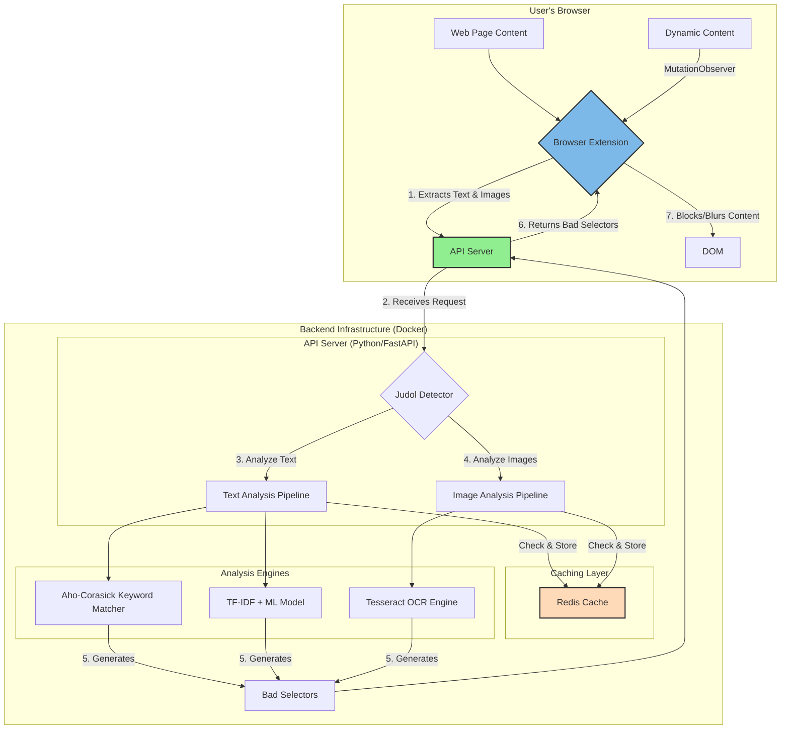

# Judol Detection Engine

A comprehensive, high-performance system to detect and block online gambling (judol) content using Machine Learning, OCR, and a browser extension.

## 🚀 Core Features

### High-Performance Backend

- **Multi-faceted Detection:** Combines ML (TF-IDF + Random Forest), ultra-fast keyword matching (`Aho-Corasick`), and OCR for image analysis (`Tesseract`).
- **Persistent Caching:** Utilizes **Redis** to cache text and image analysis results, dramatically reducing latency on repeated content.
- **Optimized Data Handling:** Uses `Polars` for high-speed CSV loading, replacing pandas for better performance.
- **Robust Element Selection:** Generates stable CSS selectors to precisely target and act on suspicious content.
- **Containerized Deployment:** Fully containerized with Docker and `docker-compose` for easy setup and scalability.

### Browser Extension (Plasmo)

- **Real-time & Dynamic Content Analysis:** Scans pages on load and monitors for new content added dynamically using `MutationObserver`.
- **Image and Text Analysis:** Extracts both text and images from the page and sends them to the backend for deep analysis.
- **Multiple Blocking Modes:** Offers "Highlight", "Blur", or "Hide" modes for detected content.
- **User-friendly Interface:** Simple popup to control settings and view page status.

## 🏛️ System Architecture

This diagram illustrates how the browser extension and backend services work together to detect and censor content.



## 📁 Project Structure

```
block-judol-engine/
├── judol_detector.py         # Core detection logic (ML, OCR, Caching)
├── api_server.py             # FastAPI server
├── keywords.csv              # Judol keywords for the Aho-Corasick matcher
├── requirements.txt          # Python dependencies
├── Dockerfile                # Docker build instructions for the API
├── docker-compose.yml        # Docker services definition (API + Redis)
├── models/
│   ├── judol_model.pkl       # Trained Random Forest model
│   └── vectorizer.pkl        # Trained TF-IDF vectorizer
└── plasmo-extension/         # Browser extension source (Plasmo)
    ├── contents/
    │   └── judol-detector.ts # Content script for page analysis
    ├── background.ts         # Background service worker
    ├── popup.tsx             # Extension popup UI (React)
    └── package.json          # Node.js dependencies
```

## 🛠️ Setup & Deployment

The entire system is designed to run in Docker containers for consistency and ease of deployment.

### Prerequisites

- Docker
- Docker Compose

### Running the System

1.  **Start the services:**

    ```bash
    docker-compose up --build
    ```

    This command will:

    - Build the Docker image for the API server, installing all Python dependencies and Tesseract OCR.
    - Pull the official Redis image.
    - Start both the API server and the Redis cache.

    The API will be available at `https://block-engine.server-fadil.my.id`.

2.  **Install the Browser Extension:**
    - Navigate to `chrome://extensions/`.
    - Enable "Developer mode".
    - Click "Load unpacked" and select the `plasmo-extension/build/chrome-mv3-dev` directory.
    - The extension will be installed and ready to use.

## 🔧 Usage

### API Endpoints

#### Health Check

```bash
curl https://block-engine.server-fadil.my.id/health
```

#### Analyze HTML Content

```bash
curl -X POST https://block-engine.server-fadil.my.id/analyze/html \
  -H "Content-Type: application/json" \
  -d '{"html": "<html>...</html>", "url": "https://example.com"}'
```

### Browser Extension

- **Automatic Detection**: The extension automatically scans pages you visit.
- **Popup Control**: Click the extension icon to adjust sensitivity and blocking modes.
- **Blocking Modes**:
  - **Highlight**: Red border around suspicious content.
  - **Blur**: Blur suspicious content with a click-to-reveal option.
  - **Hide**: Completely hide suspicious content.

## 🤖 Machine Learning & Detection Details

### Detection Layers

1.  **Redis Cache**: The first stop. If content (text hash or image URL) has been analyzed before, the cached result is returned instantly.
2.  **Aho-Corasick Keyword Matching**: An extremely fast algorithm checks for thousands of keywords in parallel. It's the primary filter for text-based content.
3.  **TF-IDF + Random Forest**: If keyword matching is inconclusive, the text is vectorized and passed to the ML model for a deeper contextual analysis.
4.  **Tesseract OCR**: For images, Tesseract extracts any embedded text, which is then run through the same text analysis pipeline (caching and keyword matching). Small images are skipped to optimize performance.

### Performance

- **Caching**: Redis caching provides sub-millisecond response times for previously seen content.
- **Aho-Corasick**: Offers significant performance gains over traditional regex or simple string matching, making text analysis very fast.
- **Polars**: Loading the `keywords.csv` file is optimized using the Polars library.

## 🤝 Contributing

- Add more sophisticated ML features (e.g., image classification models).
- Improve OCR accuracy and performance.
- Add support for more languages in both keywords and OCR.
- Enhance the extension UI/UX.
- Add comprehensive unit and integration tests.

## 📜 License

This project is for educational and protection purposes. Use responsibly and in accordance with local laws and regulations.

## ⚠️ Disclaimer

This tool is designed to help users avoid unwanted gambling content. It is not infallible and may not catch all variations of such content. Users should exercise their own judgment when browsing online.
